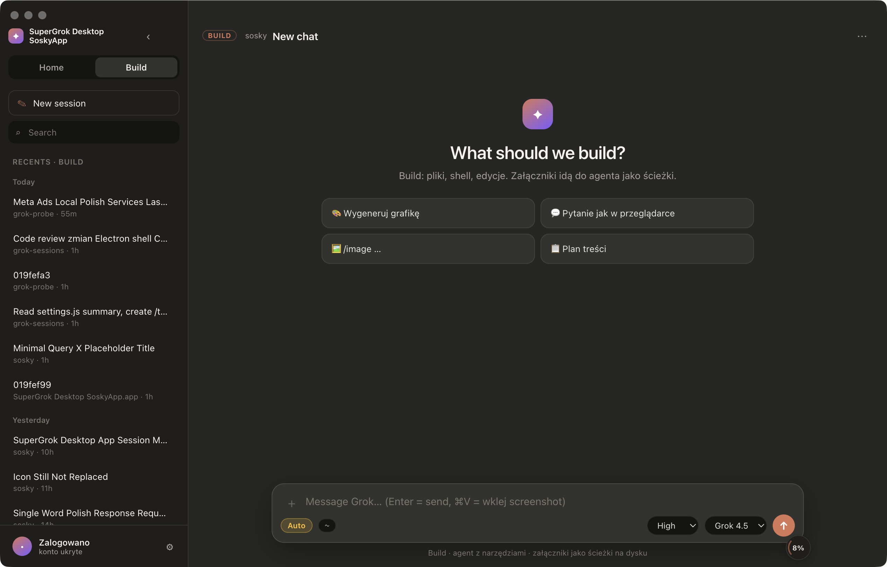

# SuperGrok Desktop SoskyApp

Desktopowa aplikacja (macOS, Electron) do pracy z **Grokiem** w stylu Claude Code:
lista sesji z boku, czat w oknie zamiast w terminalu, tryb rozmowy i tryb agenta.

- **Home** — czat jak w przeglądarce: tekst, obrazy, generowanie grafik.
- **Build** — agent Grok z narzędziami (pliki, shell, edycje), na sesjach z `~/.grok`.

**To nie jest oficjalny produkt xAI.** To otwartoźródłowa nakładka na CLI `grok`
i lokalne pliki sesji.

<!-- Zrzuty ekranu: zrób je przy uruchomionej aplikacji i wrzuć do assets/,
     potem odkomentuj poniższe linie.
     macOS: ⇧⌘4 potem spacja i klik w okno, albo:
       screencapture -w -o assets/screenshot-build.png


-->


---

## Wymagania

| Co | Po co |
|---|---|
| macOS 11+ | uruchomienie Electrona (Windows i Linux nietestowane) |
| Node.js 18+ | `npm install`, `npm start` |
| Grok CLI (`grok`) | agent i sesje |
| Konto z dostępem do Groka | logowanie przez `grok login` |

## Instalacja

```bash
git clone https://github.com/rafalsosky/grok-sessions.git
cd grok-sessions
npm install
npm start
```

### Klikalna aplikacja w Aplikacjach

```bash
npm run make-app
```

Tworzy `~/Applications/SuperGrok Desktop SoskyApp.app` ze ścieżką do projektu
wyliczoną automatycznie. Możesz podać inny katalog: `bash scripts/make-app.sh ~/Desktop`.

Aplikacja **nie jest podpisana ani notaryzowana**, więc przy pierwszym
uruchomieniu macOS ją zablokuje. Kliknij prawym przyciskiem, potem „Otwórz”.

---

## Co jest w środku

### Home
- Czat jak w przeglądarce Groka, z odpowiedzią **na żywo** (streaming)
- Generowanie grafik (`/image …`) i próba wideo, zależnie od konta
- Załączniki: przeciągnij i upuść, wklejanie zrzutów ekranu (⌘V)
- Stop przerywa faktycznie, także w trakcie odpowiedzi

### Build
- Agent Grok przez ACP (`grok agent … stdio`)
- Lista sesji z `~/.grok/sessions`
- **Tryb uprawnień: Auto albo Pytaj.** W „Pytaj” agent prosi o zgodę na każde
  narzędzie i dostajesz okno z tym, co chce zrobić. Przełącznik obok pola tekstu
  albo w Ustawieniach.
- Effort: Low / Med / High / xHigh
- Kolejka wiadomości, gdy agent pracuje, plus **↩ Wyślij teraz** (przerywa turę
  i dokłada wiadomość do bieżącego zadania)
- Strumień **izolowany per sesja** — przełączenie listy nie miesza odpowiedzi

### Wspólne
- Motyw ciemny / jasny / systemowy (Ustawienia)
- Pod każdą wiadomością: Kopiuj, Ponów, Edytuj (przy swoich), Usuń
- Bloki kodu z przyciskiem kopiowania
- Licznik czasu tury w pasku statusu
- Panel zużycia: zapełnienie kontekstu sesji, plan, opcjonalnie tygodniowy %
- Menu sesji (prawy przycisk): zmiana nazwy, nieprzeczytane, przypięcie,
  usunięcie, kopiowanie ID
- Home i Build działają **niezależnie** — agent pracujący w Build nie blokuje
  czatu Home

---

## Jak to działa

| Warstwa | Mechanizm |
|---|---|
| UI | Electron + HTML/CSS/JS (`src/`) |
| Lista sesji | skan `~/.grok/sessions/**/summary.json` |
| Historia Build | `updates.jsonl` |
| Agent | proces `grok agent … stdio` (ACP przez JSON-RPC) |
| Czat Home | HTTP do `api.x.ai` z tokenem z lokalnego logowania |
| Uwierzytelnienie | `~/.grok/auth.json`, tworzone przez `grok login` |
| Ustawienia, czaty Home, flagi | katalog `userData` aplikacji |

---

## Bezpieczeństwo i prywatność

**Co aplikacja czyta i wysyła:**

| Co | Kiedy | Dokąd |
|---|---|---|
| `~/.grok/auth.json` (token) | przy czacie Home i panelu zużycia | tylko do `api.x.ai` / `grok.com` |
| Pliki, które sam załączysz | gdy je dodasz | do modelu, w treści wiadomości |
| Ciasteczka `grok.com` z Arc/Chrome | **tylko jeśli sam włączysz** | do `grok.com`, po tygodniowy % |

**Czytanie ciasteczek przeglądarki jest domyślnie wyłączone.** Tygodniowego
procentu zużycia nie da się odczytać tokenem Build (xAI blokuje ten endpoint),
więc jedyna droga to zalogowana sesja przeglądarki. Jeśli tego potrzebujesz,
włącz w Ustawieniach: „Czytaj ciasteczka grok.com z Arc/Chrome”. Wymaga Pythona
z modułem `rookiepy`:

```bash
pip3 install rookiepy
```

Aplikacja odczytuje wtedy ciasteczka sesji `grok.com` i wysyła je **wyłącznie
do grok.com**, żeby zapytać o Twój limit. Nie chcesz tego, zostaw wyłączone:
reszta aplikacji działa normalnie, tylko pole tygodniowego % zostaje puste.

**Czego w repozytorium nie ma:** tokenów, kluczy, `auth.json`, historii czatów,
`node_modules`. Sprawdza to test w `npm test` (grupa „repo: bez zaszytych
ścieżek i danych osobowych”).

**Zabezpieczenia Electrona:** `contextIsolation` włączone, `nodeIntegration`
wyłączone, linki z odpowiedzi modelu otwierają się w przeglądarce systemowej
(nigdy w oknie aplikacji), dozwolone tylko `http` i `https`.

Po sklonowaniu u kogoś innego: własne Node, własne `grok login`, własne
`~/.grok`. Konto się nie przenosi.

---

## Skrypty

```bash
npm start                 # uruchom aplikację
npm test                  # testy logiki (bez sieci, bez UI)
npm run make-app          # zbuduj klikalne .app
npm run verify-sessions   # porównaj listę sesji z dysku z `grok sessions list`
npm run smoke             # test ACP od końca do końca (wymaga zalogowania)
```

## Struktura

```text
grok-sessions/
  electron/     # proces główny, ACP, API xAI, sesje, ustawienia
  src/          # UI (index.html, app.js, markdown.js, styles.css)
  assets/       # ikony
  scripts/      # testy, weryfikacja, budowanie .app
```

---

## Ograniczenia

- **Tygodniowy %** jak na grok.com wymaga sesji przeglądarki (patrz wyżej).
  Token Build tego nie widzi.
- **Wideo** w Home zależy od dostępności API na koncie; gdy go nie ma,
  aplikacja generuje klatkę storyboard zamiast filmu.
- **Windows i Linux** nie są testowane.
- Aplikacja nie jest podpisana certyfikatem Apple.
- Usunięcie wiadomości z widoku Build **nie kasuje jej z pamięci agenta** —
  sesja `grok` żyje po stronie CLI. Aplikacja mówi o tym wprost przy usuwaniu.

## Licencja

MIT. Marka Sosky dotyczy warstwy UI; Grok, SuperGrok i xAI to znaki xAI.

## Autor

Rafał Sobieszyński. Pytania i pull requesty: zakładka Issues na GitHubie.
