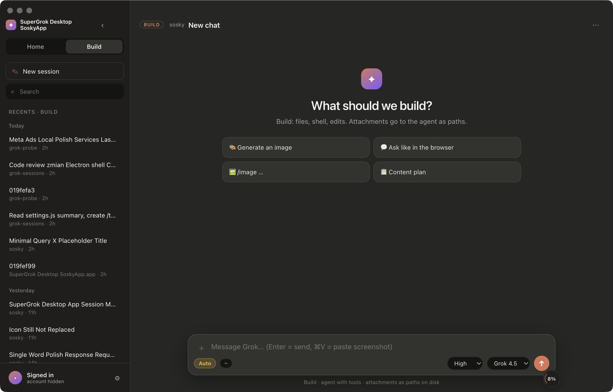
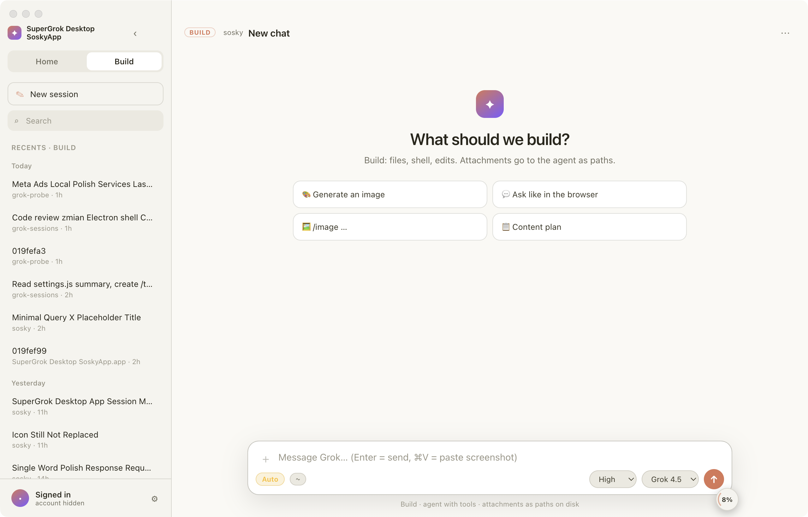

# SuperGrok Desktop SoskyApp

Desktopowa aplikacja (macOS, Electron) do pracy z **Grokiem** w stylu Claude Code:
lista sesji z boku, czat w oknie zamiast w terminalu, tryb rozmowy i tryb agenta.

- **Home** — czat jak w przeglądarce: tekst, obrazy, generowanie grafik.
- **Build** — agent Grok z narzędziami (pliki, shell, edycje), na sesjach z `~/.grok`.

**To nie jest oficjalny produkt xAI.** To otwartoźródłowa nakładka na CLI `grok`
i lokalne pliki sesji.



<details>
<summary>Motyw jasny</summary>



</details>


---

## Wymagania

| Co | Po co | Jak sprawdzić |
|---|---|---|
| macOS 11+ | patrz „Platformy” niżej | — |
| Node.js 18+ | `npm install`, `npm start` | `node -v` |
| Grok CLI (`grok`) | agent, sesje, logowanie | `grok --version` |
| Konto z dostępem do Groka | bez tego agent nie ruszy | `grok login` |

Nie masz jeszcze CLI? Instrukcja instalacji jest w dokumentacji xAI:
[docs.x.ai](https://docs.x.ai). Aplikacja szuka binarki w `~/.grok/bin/grok`;
jeśli masz ją gdzie indziej, wskaż ścieżkę w Ustawieniach albo przez
„Browse…”. Sprawdź, czy CLI działa samo, zanim uruchomisz aplikację:

```bash
grok --version && grok sessions list -n 3
```

Jeśli ta komenda działa, aplikacja też zadziała. Jeśli nie — problem jest
po stronie CLI, nie tej nakładki.

## Instalacja

```bash
git clone https://github.com/rafalsosky/grok-sessions.git
cd grok-sessions
npm install
npm start
```

### Klikalna aplikacja w Aplikacjach

```bash
npm run make-app
```

Tworzy `~/Applications/SuperGrok Desktop SoskyApp.app` ze ścieżką do projektu
wyliczoną automatycznie. Możesz podać inny katalog: `bash scripts/make-app.sh ~/Desktop`.

Aplikacja **nie jest podpisana ani notaryzowana**, więc przy pierwszym
uruchomieniu macOS ją zablokuje. Kliknij prawym przyciskiem, potem „Otwórz”.

---

## Co jest w środku

### Home
- Czat jak w przeglądarce Groka, z odpowiedzią **na żywo** (streaming) i widocznym „Myślę…”, gdy model jeszcze liczy
- Generowanie grafik (`/image …`) i próba wideo, zależnie od konta
- Załączniki: przeciągnij i upuść, wklejanie zrzutów ekranu (⌘V)
- Stop przerywa faktycznie, także w trakcie odpowiedzi

### Build
- Agent Grok przez ACP (`grok agent … stdio`)
- Lista sesji z `~/.grok/sessions`
- **Tryb uprawnień: Auto albo Pytaj.** W „Pytaj” agent prosi o zgodę na każde
  narzędzie i dostajesz okno z tym, co chce zrobić. Przełącznik obok pola tekstu
  albo w Ustawieniach.
- Effort: Low (domyślnie, szybka odpowiedź) / Med / High / xHigh. grok-4.6 nie wyłącza myślenia — Low to minimum. Ten sam przełącznik działa w Home i idzie do API jako `reasoning_effort`.
- Kolejka wiadomości, gdy agent pracuje, plus **↩ Wyślij teraz** (przerywa turę
  i dokłada wiadomość do bieżącego zadania)
- Strumień **izolowany per sesja** — przełączenie listy nie miesza odpowiedzi

### Wspólne
- Motyw ciemny / jasny / systemowy (Ustawienia)
- Pod każdą wiadomością: Kopiuj, Ponów, Edytuj (przy swoich), Usuń
- Bloki kodu z przyciskiem kopiowania
- Licznik czasu tury w pasku statusu
- Panel zużycia: zapełnienie kontekstu sesji, plan, opcjonalnie tygodniowy %
- Menu sesji (prawy przycisk): zmiana nazwy, nieprzeczytane, przypięcie,
  usunięcie, kopiowanie ID
- Home i Build działają **niezależnie** — agent pracujący w Build nie blokuje
  czatu Home

---

## Jak to działa

| Warstwa | Mechanizm |
|---|---|
| UI | Electron + HTML/CSS/JS (`src/`) |
| Lista sesji | skan `~/.grok/sessions/**/summary.json` |
| Historia Build | `updates.jsonl` |
| Agent | proces `grok agent … stdio` (ACP przez JSON-RPC) |
| Czat Home | HTTP do `api.x.ai` z tokenem z lokalnego logowania |
| Uwierzytelnienie | `~/.grok/auth.json`, tworzone przez `grok login` |
| Ustawienia, czaty Home, flagi | katalog `userData` aplikacji |

---

## Bezpieczeństwo i prywatność

**Co aplikacja czyta i wysyła:**

| Co | Kiedy | Dokąd |
|---|---|---|
| `~/.grok/auth.json` (token) | przy czacie Home i panelu zużycia | tylko do `api.x.ai` / `grok.com` |
| Pliki, które sam załączysz | gdy je dodasz | do modelu, w treści wiadomości |
| Ciasteczka `grok.com` z Arc/Chrome | **tylko jeśli sam włączysz** | do `grok.com`, po tygodniowy % |

**Czytanie ciasteczek przeglądarki jest domyślnie wyłączone.** Tygodniowego
procentu zużycia nie da się odczytać tokenem Build (xAI blokuje ten endpoint),
więc jedyna droga to zalogowana sesja przeglądarki. Jeśli tego potrzebujesz,
włącz w Ustawieniach: „Czytaj ciasteczka grok.com z Arc/Chrome”. Wymaga Pythona
z modułem `rookiepy`:

```bash
pip3 install rookiepy
```

Aplikacja odczytuje wtedy ciasteczka sesji `grok.com` i wysyła je **wyłącznie
do grok.com**, żeby zapytać o Twój limit. Nie chcesz tego, zostaw wyłączone:
reszta aplikacji działa normalnie, tylko pole tygodniowego % zostaje puste.

**Czego w repozytorium nie ma:** tokenów, kluczy, `auth.json`, historii czatów,
`node_modules`. Sprawdza to test w `npm test` (grupa „repo: bez zaszytych
ścieżek i danych osobowych”).

**Zabezpieczenia Electrona:** `contextIsolation` włączone, `nodeIntegration`
wyłączone, linki z odpowiedzi modelu otwierają się w przeglądarce systemowej
(nigdy w oknie aplikacji), dozwolone tylko `http` i `https`.

Po sklonowaniu u kogoś innego: własne Node, własne `grok login`, własne
`~/.grok`. Konto się nie przenosi.

---

## Skrypty

```bash
npm start                 # uruchom aplikację
npm test                  # testy logiki (bez sieci, bez UI)
npm run make-app          # zbuduj klikalne .app
npm run verify-sessions   # porównaj listę sesji z dysku z `grok sessions list`
npm run smoke             # test ACP od końca do końca (wymaga zalogowania)
```

## Struktura

```text
grok-sessions/
  electron/     # proces główny, ACP, API xAI, sesje, ustawienia
    main.js         # IPC, pula agentów, watchery, cykl życia okna
    agent-pool.js   # jeden proces `grok` na jedną sesję Build
    acp-client.js   # klient ACP po stdio
    sessions.js     # skan ~/.grok/sessions, tytuły sesji
    transcript.js   # historia z updates.jsonl
  src/          # UI — ładowane zwykłymi <script>, WSPÓLNY zakres globalny
    i18n.js         # 1. słownik PL (baza jest angielska)
    markdown.js     # 2. markdown → HTML
    work-summary.js # 3. „Read 7 files, ran 5 commands”
    chat-history.js # 4. merge transkryptu z żywymi bańkami
    chat-scroll.js  # 5. trzymanie dołu tylko gdy user jest przy dole
    app.js          # 6. cały renderer
  assets/       # ikony
  scripts/      # testy, weryfikacja, budowanie .app
```

Kolejność ładowania z `index.html` jest nośna, a wszystkie moduły w `src/`
dzielą **jeden** globalny zakres. Dlatego każdy jest owinięty w IIFE: bez tego
`const api` z drugiego pliku wywala go w całości (`Identifier 'api' has already
been declared`) i moduł po prostu nie istnieje w oknie, a `app.js` cicho
schodzi na zaślepki. Testy w Node tego nie widzą — każdy plik ma tam własny
zakres modułu — więc `npm test` uruchamia bundle w kontekście z atrapą `window`.

### Język interfejsu

Baza jest angielska, polski siedzi w `src/i18n.js`. Przełącznik jest
w Ustawieniach (`Language`). Nie wstawiaj polskich literałów do `app.js` —
`npm test` to blokuje.

---

## Ograniczenia

- **Tygodniowy %** jak na grok.com wymaga sesji przeglądarki (patrz wyżej).
  Token Build tego nie widzi.
- **Wideo** w Home zależy od dostępności API na koncie; gdy go nie ma,
  aplikacja generuje klatkę storyboard zamiast filmu.
- **Windows i Linux**: patrz „Platformy” niżej.
- Aplikacja nie jest podpisana certyfikatem Apple.
- Usunięcie wiadomości z widoku Build **nie kasuje jej z pamięci agenta** —
  sesja `grok` żyje po stronie CLI. Aplikacja mówi o tym wprost przy usuwaniu.

---

## Platformy

Zbudowane i używane na macOS. Reszta kodu jest przenośna (Electron, `path.join`,
`os.homedir()`), ale **cztery rzeczy są zrobione pod macOS** i na Windows albo
Linuksie wymagają pracy:

| Element | Stan poza macOS | Ile roboty |
|---|---|---|
| Przycisk „Log in” (otwiera terminal z `grok login`) | nie działa, aplikacja mówi wprost, żeby wpisać komendę ręcznie | mała: `cmd /c start` albo `x-terminal-emulator` |
| Wygląd paska tytułu (`hiddenInset`, pozycja przycisków) | ignorowane, okno może wyglądać inaczej | mała |
| Ikona aplikacji (`.icns`) | Windows chce `.ico` | mała |
| `scripts/make-app.sh` (buduje `.app`) | tylko macOS | trzeba osobnego pakowania, np. electron-builder |

Sam rdzeń — lista sesji, agent po ACP, czat, załączniki, ustawienia — nie ma
w sobie nic macOS-owego. Katalog danych i nazwa binarki (`grok.exe`) są już
obsłużone per system.

**Nie deklaruję wsparcia dla Windows, bo tego nie przetestowałem.** Jeśli
odpalisz to u siebie i zadziała, daj znać w Issues — chętnie dopiszę do
README, a poprawki do tych czterech punktów przyjmę jako PR.

---

## Coś nie działa

| Objaw | Przyczyna |
|---|---|
| „grok binary not found” | Ustawienia → wskaż ścieżkę przez „Browse…” |
| Lista sesji pusta | `grok sessions list` też jest puste? Wtedy to CLI, nie aplikacja |
| „Not signed in” mimo logowania | sprawdź `~/.grok/auth.json`; jeśli go nie ma, `grok login` się nie dokończyło |
| Aplikacja nie startuje po `npm start` | `node -v` musi być 18+; usuń `node_modules` i `npm install` od nowa |
| macOS blokuje `.app` | prawy przycisk → Otwórz (aplikacja nie jest podpisana) |
| `.app` alarmuje, że nie ma Electrona, choć jest | launcher zna ścieżkę z chwili budowania. Projekt przeniesiony → `npm run make-app` od nowa |
| Odpowiedź długo nic nie pisze | grok-4.6 zawsze myśli. Ustaw Effort na Low (domyślnie od 0.3.1). High/xHigh są wolne z założenia |
| Zmiana modelu/efortu nic nie robi | sesja jest w trakcie tury — restart procesu agenta jest wtedy niemożliwy, apka mówi to wprost |
| Tygodniowy % pusty | tak ma być, dopóki nie włączysz czytania ciasteczek (patrz „Bezpieczeństwo”) |

Logi aplikacji: `$TMPDIR/supergrok-desktop.log` przy starcie z `.app`,
a przy `npm start` lecą na konsolę. Devtools: `GROK_SESSIONS_DEBUG=1 npm start`.

## Licencja

MIT. Marka Sosky dotyczy warstwy UI; Grok, SuperGrok i xAI to znaki xAI.

## Autor

Rafał Sobieszyński. Pytania i pull requesty: zakładka Issues na GitHubie.
